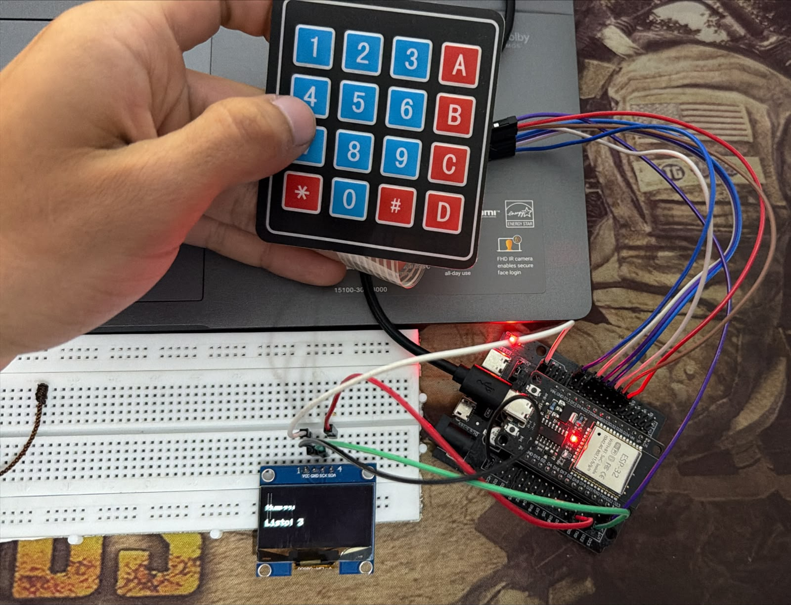

# Brazo Robótico en PyBullet Controlado por ESP32 🤖🖊️

Este proyecto integra hardware (ESP32) y software de simulación (PyBullet) para controlar un brazo robótico capaz de escribir números en una pizarra virtual. Mediante un teclado matricial 4x4 y una pantalla OLED SH1106, el usuario ingresa un número, la ESP32 lo procesa y lo envía por puerto Serial a un script en Python. 

El script utiliza OpenCV para extraer los contornos del texto y cinemática inversa para que el modelo URDF del brazo dibuje el trayecto exacto en la simulación.

## 🎥 Demostración
<!-- Reemplaza TU_ENLACE_DE_YOUTUBE por el ID de tu video -->
[](https://youtube.com/shorts/BWrsKaYS0Ik?si=BDTEaL4P9bpe0eT1)

## 📸 Montaje Físico
<!-- Reemplaza ruta_de_tu_imagen.jpg por el nombre de tu archivo de imagen -->


---

## 🛠️ Requisitos de Hardware

* **Microcontrolador:** ESP32 (ej. DOIT DevKit V1).
* **Pantalla:** OLED I2C de 1.3" (Controlador SH1106, 4 pines: VCC, GND, SDA, SCK).
* **Teclado:** Matricial 4x4 de membrana.
* Cables jumper y protoboard.

### Esquema de Conexiones

| Componente | Pin Físico | Pin ESP32 | Notas |
| :--- | :--- | :--- | :--- |
| **OLED SH1106** | VCC | 3.3V | Alimentación |
| **OLED SH1106** | GND | GND | Tierra |
| **OLED SH1106** | SDA | GPIO 21 | Bus I2C de datos |
| **OLED SH1106** | SCK / SCL | GPIO 22 | Bus I2C de reloj |
| **Teclado 4x4** | Filas (F1-F4)| GPIO 13, 14, 27, 26 | Salidas digitales |
| **Teclado 4x4** | Colum (C1-C4)| GPIO 25, 33, 32, 23 | Entradas con Pull-up |

---

## 💻 Códigos y Configuración (Software)

### 1. Entorno de la ESP32 (C++ / PlatformIO)
Crea un proyecto en **PlatformIO** (VS Code) y utiliza los siguientes archivos:

**`platformio.ini`** (Configuración de dependencias)
```ini
[env:esp32doit-devkit-v1]
platform = espressif32
board = esp32doit-devkit-v1
framework = arduino
monitor_speed = 115200
lib_deps = 
    adafruit/Adafruit SH110X @ ^2.1.8
    adafruit/Adafruit GFX Library @ ^1.11.5
    chris--a/Keypad @ ^3.1.1
```

**`src/main.cpp`** (Código principal)
<details open>
<summary>Haz clic para expandir el código completo de la ESP32</summary>

```cpp
#include <Arduino.h>
#include <Wire.h>
#include <Adafruit_GFX.h>
#include <Adafruit_SH110X.h>
#include <Keypad.h>

#define SCREEN_WIDTH 128
#define SCREEN_HEIGHT 64
#define OLED_RESET -1

Adafruit_SH1106G display = Adafruit_SH1106G(SCREEN_WIDTH, SCREEN_HEIGHT, &Wire, OLED_RESET);

const byte FILAS = 4;
const byte COLUMNAS = 4;
char teclas[FILAS][COLUMNAS] = {
  {'1','2','3','A'},
  {'4','5','6','B'},
  {'7','8','9','C'},
  {'*','0','#','D'}
};
byte pinesFilas[FILAS] = {13, 14, 27, 26};
byte pinesColumnas[COLUMNAS] = {25, 33, 32, 23};
Keypad teclado = Keypad(makeKeymap(teclas), pinesFilas, pinesColumnas, FILAS, COLUMNAS);

#define LED_PIN 2
const int MAX_CIFRAS = 4;
String numero = "";
String txt_estado = "#=Dibujar *=Borr";

void refrescarPantalla() {
  display.clearDisplay();
  display.setTextSize(1);
  display.setTextColor(SH110X_WHITE);
  display.setCursor(0, 15);
  display.print("Numero: ");
  display.print(numero);
  if (numero.length() < MAX_CIFRAS) display.print("_");
  display.setCursor(0, 35);
  display.print(txt_estado);
  display.display();
}

void actualizarEstado(String nuevoEstado) {
  txt_estado = nuevoEstado.substring(0, 16);
  refrescarPantalla();
}

void setup() {
  Serial.begin(115200);
  pinMode(LED_PIN, OUTPUT);
  Wire.begin(21, 22);
  delay(250); 
  
  if(!display.begin(0x3C, true)) {
    Serial.println("Error al inicializar OLED SH1106.");
  } else {
    display.clearDisplay();
    display.display();
  }
  Serial.println("ESP32 lista: teclado + OLED SH1106 (C++)");
  refrescarPantalla();
}

void loop() {
  char tecla = teclado.getKey();
  if (tecla) {
    Serial.print("TECLA:"); Serial.println(tecla);
    digitalWrite(LED_PIN, HIGH); delay(40); digitalWrite(LED_PIN, LOW);

    if (isdigit(tecla)) {
      if (numero.length() < MAX_CIFRAS) { numero += tecla; refrescarPantalla(); } 
      else { actualizarEstado("Max 4 cifras"); }
    } 
    else if (tecla == '*') {
      if (numero.length() > 0) { numero.remove(numero.length() - 1); refrescarPantalla(); }
    } 
    else if (tecla == '#') {
      if (numero.length() > 0) {
        Serial.print("NUM:"); Serial.println(numero);
        actualizarEstado("Enviado: " + numero);
        numero = ""; refrescarPantalla();
      } else { actualizarEstado("Escribe un num."); }
    } 
    else if (tecla == 'A') { Serial.println("CMD:A"); actualizarEstado("Repitiendo..."); } 
    else if (tecla == 'B') { Serial.println("CMD:B"); actualizarEstado("Borrando..."); } 
    else if (tecla == 'C') { Serial.println("CMD:C"); actualizarEstado("Brazo a home"); } 
    else if (tecla == 'D') { numero = ""; actualizarEstado("#=Dibujar *=Borr"); }
  }

  if (Serial.available() > 0) {
    String msg = Serial.readStringUntil('\n');
    msg.trim();
    if (msg.startsWith("LCD:")) { actualizarEstado(msg.substring(4)); }
  }
}
```
</details>

### 2. Entorno de Simulación (Python & PyBullet)
Para el PC, debes tener instalada una versión de **Python que soporte los wheels precompilados de PyBullet (Recomendado Python 3.10 o 3.11)**.

Instala las dependencias necesarias:
```bash
pip install pybullet pyserial opencv-python numpy
```

*(Nota: Asegúrate de incluir en este repositorio tus archivos `dibujar_brazo_teclado.py` y tu modelo `brazo.urdf` en la carpeta raíz del proyecto).*

---

## 🚀 Pasos para Ejecutar el Proyecto

1. **Carga el código en la ESP32:** Abre el proyecto de PlatformIO, compila y sube el código a la placa. Al terminar, **cierra el Monitor Serial de VS Code** para liberar el puerto COM.
2. **Conecta la ESP32:** Asegúrate de saber qué puerto se le asignó (por ejemplo, `COM3` en Windows o `/dev/ttyUSB0` en Linux).
3. **Inicia la simulación:** Abre una terminal en la carpeta donde tienes tu script de Python y ejecútalo:
   ```bash
   python dibujar_brazo_teclado.py
   ```

---

## 🕹️ Controles del Teclado

Una vez la simulación de PyBullet esté en pantalla y la ESP32 conectada, usa el teclado matricial físico para controlar el robot:

* `0` al `9`: Digita el número que deseas dibujar (hasta 4 cifras).
* `#`: **Enviar y Dibujar**. Transmite el número a PyBullet para iniciar la trayectoria.
* `*`: **Borrar carácter**. Elimina la última cifra ingresada en la pantalla OLED.
* `A`: **Repetir**. Repite el último trazo enviado al simulador.
* `B`: **Borrar Pizarra**. Limpia la superficie de dibujo en la simulación.
* `C`: **Home**. Ordena al brazo robótico regresar a su posición inicial de reposo.
* `D`: **Reset Pantalla**. Limpia el texto en la OLED y reinicia la variable numérica.
